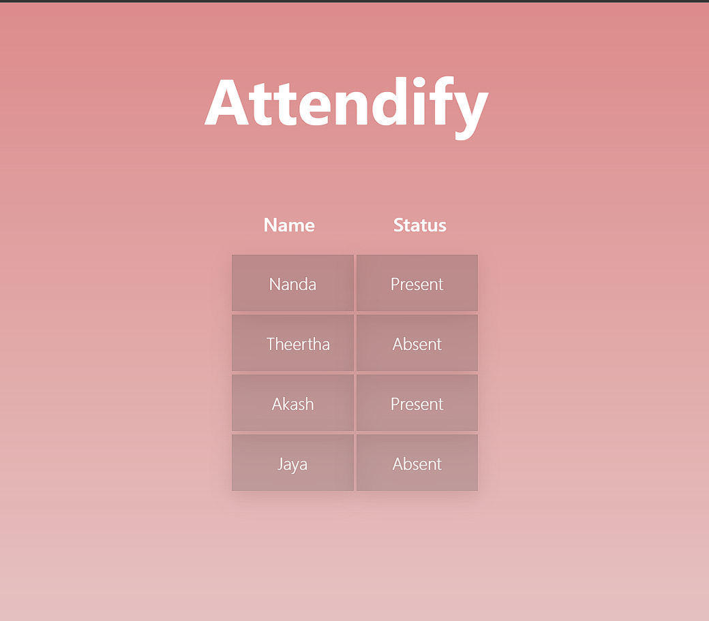

# Attendify
A Web App which can authenticate your attendence through face detection. Can be implemented in places such as schools and offices making the process of verifying a person's prescence more seamless

## Team members
[Akash P](https://github.com/FrostyCake47) <br />
[Nanda Krishna](https://github.com/frostyscupcake) <br />
[Theertha](https://github.com/Aquabenedicta) <br />
[B Jayalakshmi](https://github.com/BJayalakshmi) <br />

## Link to product walkthrough

## How it Works ?

The dataset of the members are trained through and model in [Teachable Machine](https://teachablemachine.withgoogle.com/train/image) and model is to exported with the setting for KerasCV. Alternatively we can also use the ```datacollection.py``` for creating separate classes for models too. <br/>
The model is then loaded and a video stream of an attendee is provided using OpenCV. <br/>
during the process the face of the attendee is used to predict for matching classes in the trained model. When the model finds a success thier prescence is noted down in a database. `backend\db.json` in this context <br/>
Json-server is used to watch over this database and a fetch request can be placed to access this data for the frontend part.


## Libraries used

Keras CV, TensorFlow<br />
Pillow<br />
OpenCV<br />
React Js (Frontend)<br />
Json-Server<br />

## How to configure


## How to Run
```npm start run``` for running the app <br />
```npx json-server --watch ./backend/db.json --port 9000``` for turning on the json-server<br />
```python backend detection.py``` for running the detection script<br />
